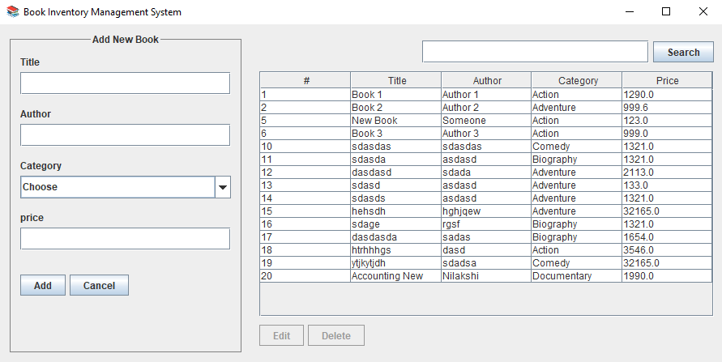

# 📚 Book Inventory Management System  

**Book Inventory Management System** is a desktop application built in Java with a user-friendly GUI for managing book records. This project demonstrates essential CRUD operations, input validation, error handling, and search functionality.

---

## 🚀 Features  

- **CRUD Operations**: Add, update, delete, and view book records.  
- **Search**: Quickly find books by title.  
- **Input Validation**: Ensures data integrity (e.g., no empty fields, valid price values).  
- **Error Handling**: Provides user-friendly messages for invalid inputs or duplicate entries.  
- **Responsive Design**: Swing-based UI for seamless navigation.  

---

## 🛠️ Tech Stack  

- **Java**: Core language for application logic and GUI.  
- **Swing**: For designing the graphical user interface.  
- **MySQL**: Database for storing book records.  

---

## 📸 Screenshots 

